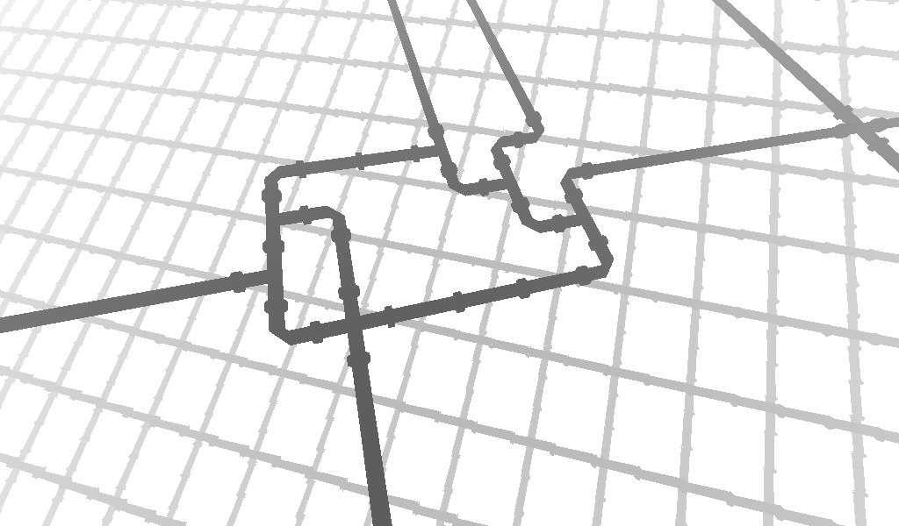
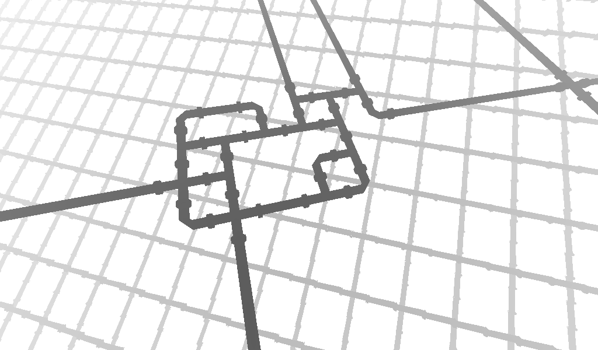

# Hints

## Step 1

  
Minor hint

  
  

## Step 2

  
Very minor hint

  Look up after solving step 1 and getting the second upgrade.

  
Minor hint

  
  Maybe this guy can help you:
  

  
Major hint

  
  The code for the Caesar Cipher is 7.

## Step 3

  
Minor hint

  
  Turn on all the lights, it will reveal an elevator code to the roof.

## Step 4

  
Minor hint

  
  Use the code you can spot from the roof (use the code from step 3 to access the roof) to open the large VAB door.

## Step 5

  
Minor hint

  
  Use the code you can spot from the roof to open the large VAB door. You can use the code "0000" to get back to the ground floor.

## Step 6

  
Minor hint

  
  Now with all upgrades, you can see the moon.

  
Major hint

  
  The code to the launch pad is the name of the space station.

## Step 7

  
Minor hint

  
  The two refueling stations have pipes that need to be reconnected into a closed system.

  
SOLUTIONS

  
  

  

